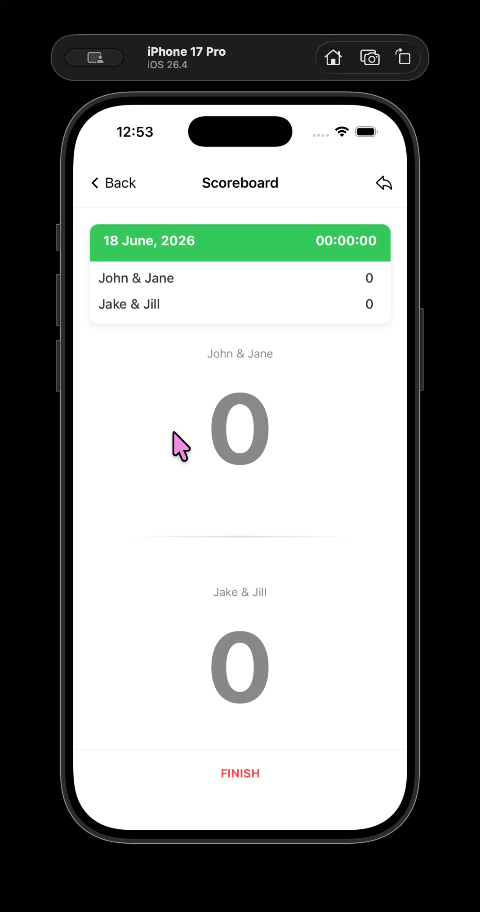
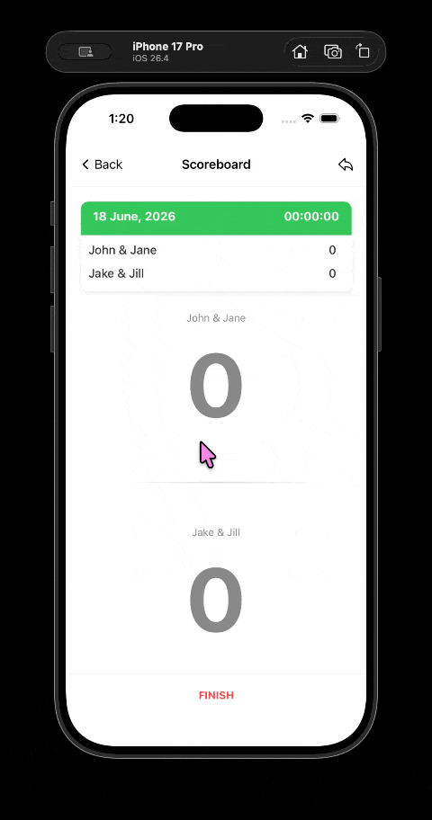

# 🎾 Tennis Scoring App
A lightweight, mobile and smartwatch(soon) application designed to track tennis match scoring, game logic, sets, and tiebreaks in real time.

## 📌 Overview

Tracking fast-paced match scores on court requires an instant, reliable interface without lag or state errors. This project implements a dedicated scoring engine using **React Native** for mobile and **Swift** for smartwatch integration, ensuring match state remains strictly synchronized across devices.

### Key Features
* **Real-time Match Logic:** Handles complex tennis scoring rules including advantage, set tiebreaks, and match-point logic.
  Scoring Demo:
  

  Deuce Demo:
  

* **AI-Assisted Workflow:** Built using modern AI development tools (Claude, GitHub Copilot

## Tech Stack

* **Frontend / Cross-Platform:** React Native, Expo Framework, JavaScript / TypeScript
* **Native Wearable Integration:** Swift (WatchOS / Native Hooks)
* **Version Control & CI:** Git, GitHub
